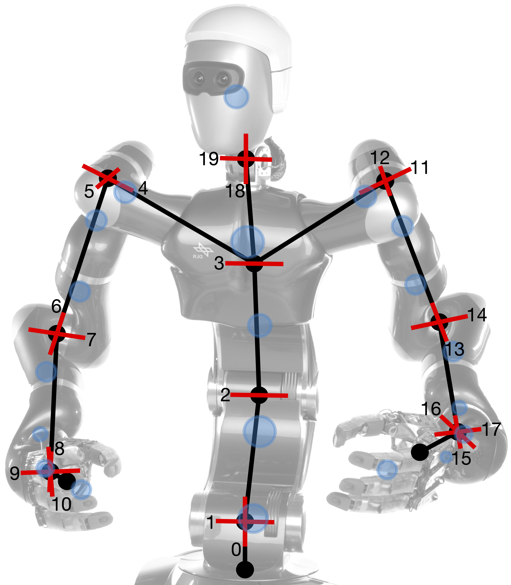

This site complements our research on self-contained and automatic robot calibration. 
For more information, please refer to one of the papers below.

### [Bayesian View on Task-Oriented Robot Calibration](_pages/tro24.md)
Submitted to T-RO 2024 by
[Johannes Tenhumberg](https://scholar.google.com/citations?user=2RZuYZMAAAAJ){:target="_blank"} 
[Darius Burschka](https://scholar.google.com/citations?user=y-MzVoUAAAAJ){:target="_blank"} and 
[Berthold Bäuml](https://scholar.google.com/citations?hl=en&user=fjvpDsEAAAAJ){:target="_blank"}.

---

### [Self-Contained and Automatic Calibration of a Multi-Fingered Hand Using Only Pairwise Contact Measurements](_pages/humanoids23.md)
Humanoids 2023 by
[Johannes Tenhumberg\*](https://scholar.google.com/citations?user=2RZuYZMAAAAJ){:target="_blank"}, 
[Leon Sievers\*](https://www.linkedin.com/in/leon-sievers/){:target="_blank"} and 
[Berthold Bäuml](https://scholar.google.com/citations?hl=en&user=fjvpDsEAAAAJ){:target="_blank"}.

[Full Paper](https://arxiv.org/abs/2311.03957){:target="_blank"} / 
[Video](https://www.youtube.com/watch?v=dkG9xz1fhOU){:target="_blank"}

---

### [Self-Contained Calibration of an Elastic Humanoid Upper Body Using Only a Head-Mounted RGB Camera](_pages/humanoids22.md)
Humanoids 2022 by
[Johannes Tenhumberg](https://scholar.google.com/citations?user=2RZuYZMAAAAJ){:target="_blank"} 
[Dominik Winkelbauer](https://scholar.google.com/citations?user=kduGd8wAAAAJ){:target="_blank"} 
[Darius Burschka](https://scholar.google.com/citations?user=y-MzVoUAAAAJ){:target="_blank"} and 
[Berthold Bäuml](https://scholar.google.com/citations?hl=en&user=fjvpDsEAAAAJ){:target="_blank"}.

[Full Paper](https://arxiv.org/abs/2311.08338){:target="_blank"}

{:.this 
style="width: 500px; 
display: block;
margin-left: auto;
margin-right: auto"}

---
### [Calibration of an Elastic Humanoid Upper Body and Efficient Compensation for Motion Planning](_pages/humanoids21.md)
Humanoids 2021 by
[Johannes Tenhumberg](https://scholar.google.com/citations?user=2RZuYZMAAAAJ){:target="_blank"} and 
[Berthold Bäuml](https://scholar.google.com/citations?hl=en&user=fjvpDsEAAAAJ){:target="_blank"}.

[Full Paper](https://arxiv.org/abs/2311.08333){:target="_blank"}

{:.this 
style="width: 300px; 
display: block;
margin-left: auto;
margin-right: auto"}
